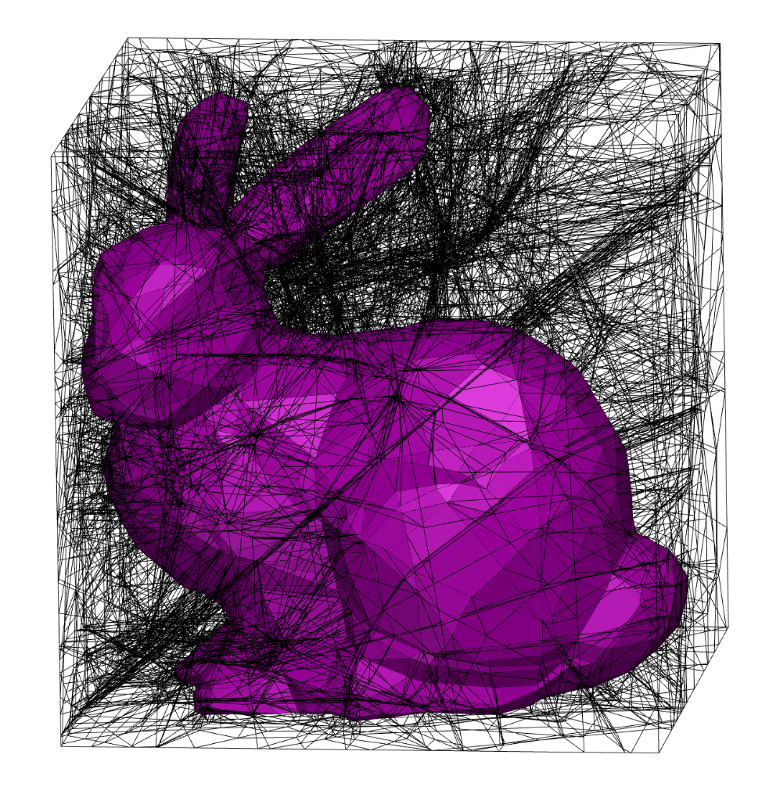

# Polyhedral Complex Extraction from ReLU Networks using Edge Subdivision
### **[arXiv](https://arxiv.org/abs/2306.07212)** | **[PMLR](https://proceedings.mlr.press/v202/berzins23a.html)** | **[Extended abstract](https://openreview.net/forum?id=QrJ6WaWfuP)** | **[Presentation & Poster](https://icml.cc/virtual/2023/poster/23539)**



View an interactive 3D version <a href="https://html-preview.github.io/?url=https://github.com/arturs-berzins/relu_edge_subdivision/blob/master/media/bunny_nopanel.html">here</a>!


Compute the polyhedral complex associated with a ReLU network.
Contrary to previous methods the proposed method subdivides edges, which alleviates computational redundancy and affords simple data structures and GPU acceleration.

This repo implements the proposed algorithm in vanilla `PyTorch` with `CUDA` support.


## BibTeX

```
@InProceedings{Berzins23,
  author    = {Berzins, Arturs},
  title     = {Polyhedral Complex Extraction from ReLU Networks using Edge Subdivision},
  booktitle = {Proceedings of the 40th International Conference on Machine Learning},
  year      = {2023},
  volume    = {202},
  series    = {Proceedings of Machine Learning Research},
  publisher = {PMLR},
}
```